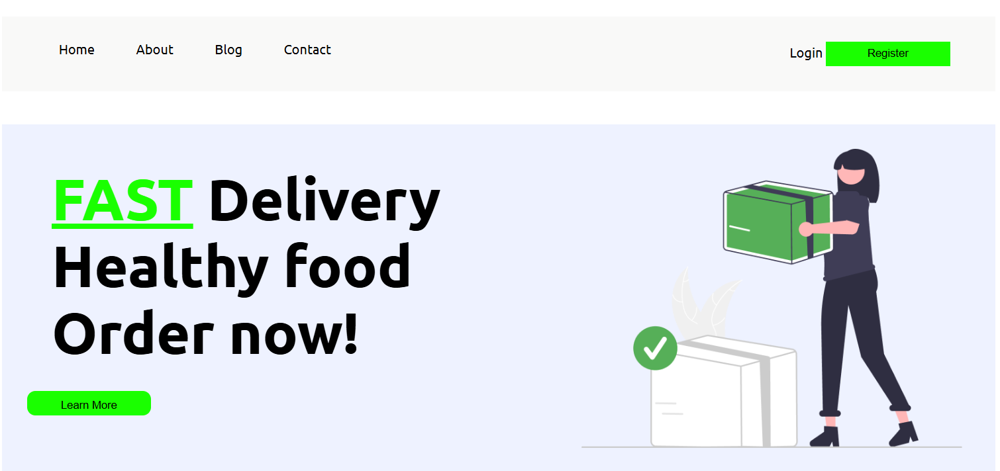

<div align="center">

#figma

**A responsive and clean web page built entirely with pure CSS.**

[**➥ Live Demo**](https://asya948.github.io/figma/)

</div>

---

## About the Project

This is a modern, mobile-friendly website tailored for a construction or handyman business.  
It features dedicated sections like Home, About Us, Team, and a strong Landing area — giving a complete overview of a company's values, vision, and services.

✅ Built 100% with **custom CSS**  
✅ Fully responsive and beginner-friendly  
✅ Great reference for clean layout and HTML/CSS structure


---

## Demo Screenshot

 "Desktop Demo")

---

## Getting Started

Make sure you have [Git](https://git-scm.com/downloads) installed. Then run:

```bash
git clone https://github.com/asya948/figma.git
```

---

## Want to connect?

If you'd like to connect, collaborate, or just explore more of my work:

- 🔗 **See more on GitHub**: [Asya-Nersesyan](https://github.com/asya948)
- 💼 **Connect with me on LinkedIn**: [My LinkedIn Profile](https://www.linkedin.com/in/asya-nersesyan-461a0937a/)

Feel free to reach out!

---

## License

This project is open-source and available under the [MIT License](LICENSE).

---
